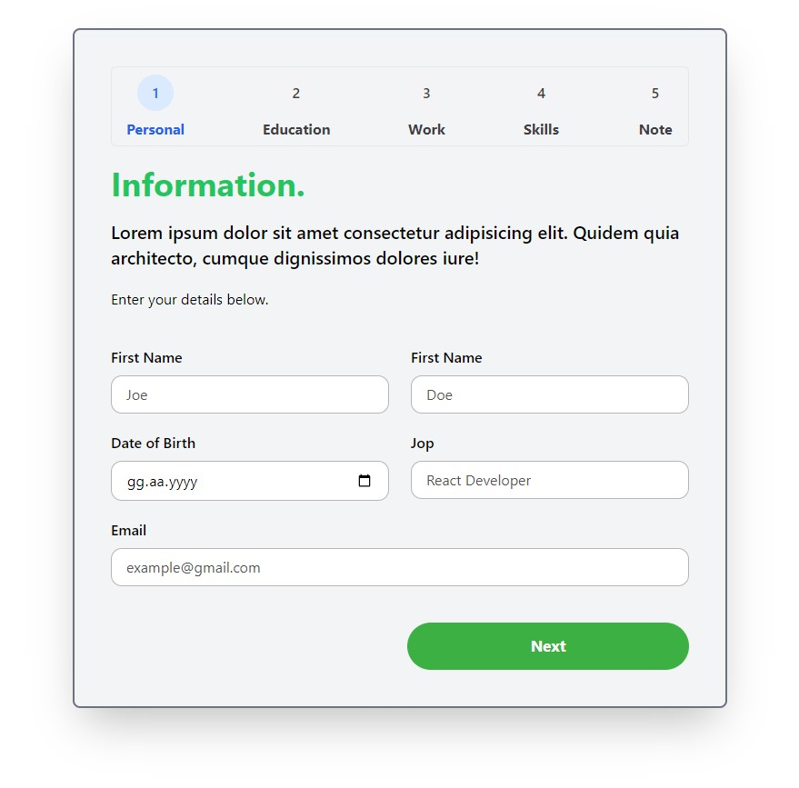

# 5 Step Stepper Form

You can contact me for your questions and suggestions. 
If you see my mistakes and tell me, it can be very useful for me to improve.
Web : enesbilen.com
Mail : c.enesbilen@gmail.com

<h3>Get Step-by-Step Information Using Stepper Form</h3>

A stepper form is a type of form used to collect a series of information from the user. This allows information to be presented step by step and collected in an organized way. The technologies used in this particular project are:

# React + Vite + Tailwind.css + Formik + Toast + propTypes

<h4>Button Component</h4>
A core component of the project, the Button component is used to control the style and behavior of all buttons on the form. This component takes a set of properties, including button type, size, variant, ID and more. This way you can easily customize and use all buttons. The PropTypes and default properties of the Button component ensure that the component is used correctly.

<h4>5-Step Stepper Form</h4>
The project includes a stepper form with 5 steps. These steps represent "Personal", "Education", "Work", "Skills" and "Note". The user provides the information step by step by filling these steps respectively.

The form contains fields that can and cannot be skipped. This prevents users from skipping certain steps or going back, thus ensuring that each step is filled in correctly. By using Formik, form management is streamlined and users are properly informed.

<h3>Screen</h3>
